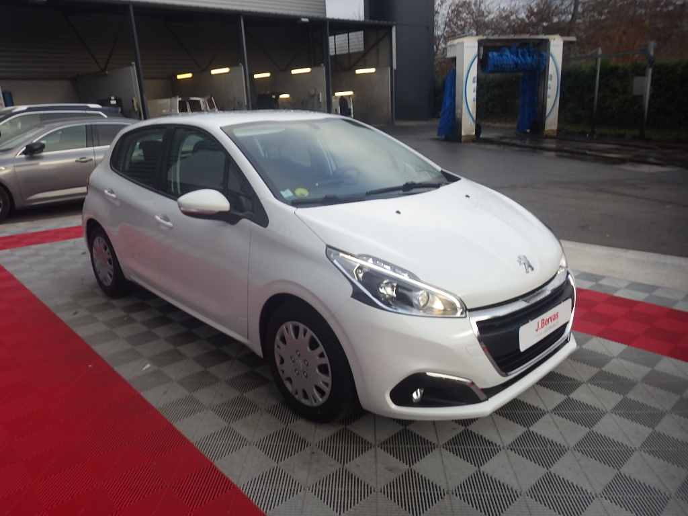
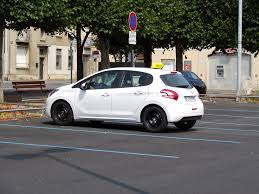

<!DOCTYPE html>
<html lang="fr">
<head>

    <meta charset="UTF-8">
 
    <title>auto ecole HEBIB HAKIM</title>
    <link rel="stylesheet" href="auto ecole .css">
    <link rel="stylesheet" href="https://cdnjs.cloudflare.com/ajax/libs/font-awesome/4.7.0/css/font-awesome.css">
    
</head>
<body>
    <header>
        

        <nav>  
            <ul>
                <li id="logo"><a href="#">ProSA </a></li>
                <li><a href="#contact">nous contacter </a></li>
                <li><a href="#dossier">dossier à fournir</a></li>
                <li><a href="#permis auto">permis auto </a></li>
            </ul>

        </nav>

        

        <h1>AUTO-ECOLE HEBIB HAKIM</h1>
        

        <h3>ecole de conduite </h3> 
        

    </header>
    <section id="presentation">
        
 
        <h2>permis auto  </h2>
        
 Á auto-ecole HEBIB HAKIM , nous vous proposons les differents type de  permis auto, en fonction de vos besoins : du permis B en apprentissage classique à la conduite supervisée, en passant par le stage permis accéléré. Notre école de conduite dispose de tout l’équipement nécessaire pour un apprentissage réussi .
 
        

    </section>

    

        <H4>Code</H4>
        
        <h4>Creneau</h4>
        
        <h4>conduite</h4>
        
    
    
    
     
  
     <h4>Où nous trouver</h4>

    <iframe src="https://www.google.com/maps/embed?pb=!1m18!1m12!1m3!1d3198.2579242545394!2d4.033362120318334!3d36.71636632543071!2m3!1f0!2f0!3f0!3m2!1i1024!2i768!4f13.1!3m3!1m2!1s0x128dc70f1280f1b5%3A0xc7f39d068107436f!2sauto%20ecole%20HEBIB%20HAKIM!5e0!3m2!1sfr!2sdz!4v1659516216634!5m2!1sfr!2sdz" width="500" height="300" style="border:0;" allowfullscreen="" loading="lazy" referrerpolicy="no-referrer-when-downgrade"></iframe>

    <footer>
        <h2 id="contact">contacter nous </h2>
        <form >
            <input placeholder="Nom">
            <input placeholder="E-mail">
            <textarea placeholder="Votre message"></textarea>
            <button>envoyer</button>

        </form>
        

        

        

         ProSA
        

        

            <a href="http://www.twitter.fr"><i class="fa fa-twitter"></i></a>
            <a href="http://www:facebook.com"><i class="fa fa-facebook"></i></a>
            <a href="http://www.instagram.fr"><i class="fa fa-instagram"></i></a>

        

        

    </footer>
    
</body>
</html>
